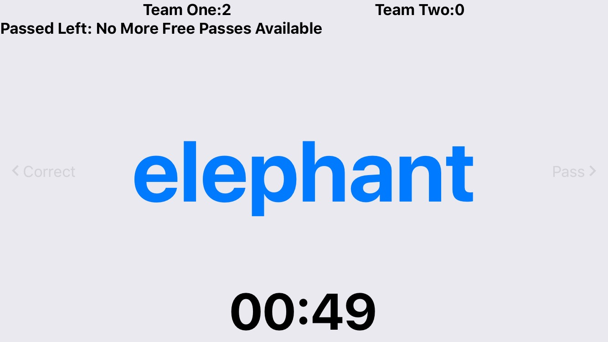

#  What Do You Mime? 

A reverse charade party game. In this game, you are split into two teams. Each team select a guesser(everyone gets a turn guessing) and the rest of the team act out the words.

Test this game out on expo https://expo.io/@late4tea/What_Do_You_Mime

Built with React Native, Expo and React Native Router Flux.
